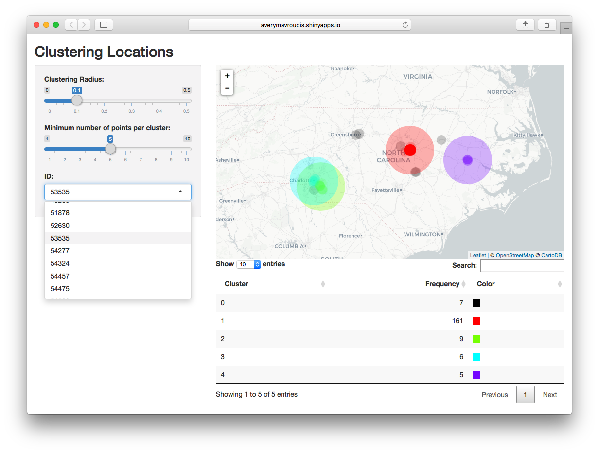

# Location Clustering
 
 This **README** will explain the variety of tools and methods of the `locations` repository by **averymavroudis**.

## The Problem
Suppose you have coordinate data of many different geo located events, objects, people, etc. that are grouped by an ID. We'd like to predict the region where the next event is most likely to happen or determine the centrality of events by frequency. 

## The Method
__Skip this section if you have previous experience working with machine learning algorithms or have deep familiarity with clustering.__

A __DBSCAN__ algorithm is used for clustering for all location data (**D**ensity-**B**a**S**ed **C**lustering of **A**pplications with **N**oise). 

I chose to use this particular one in comparison to K-Means and KNN (**K** **N**earest **N**eighbors) versus other algorithms for the following reasons. 

-  __DBSCAN__ is better for the sample data used here (and generally better for data with outliers) because it:
	- Clusters points by frequency and proximity given a certain space or radius
	- Determines the necessary number of clusters accordingly 
		- __No need to have a fixed k/number of clusters__ *a priori*
		- _Very important_ if number of needed clusters or groups is ambiguous
	- Declares outliers as the points in lower-density and/or farther regions (and puts them in an outlier "cluster")
	- Clusters may be geometrically shaped (versus typical cell shape of K clusters)

## The Code
Below is a glimpse of each code in the repository, how and what it is used for, and a general guide to use.

### `init.R`
This R script is sourced in other scripts purely for the purpose of installing preliminary packages **only if** you do not already have them in your R list of packages. It does not have any operational use other than to prepare other files for screecreenshouse. 

### `clustering.R`
If used as a standalone function, clustering returns a list of information when you input a CSV file with ID, Latitude, and Longitude.

Unfortunately, it does not parse the CSV by ID. If you have a CSV with many different ID's as such, you will get have clustered generated with all of the data in the CSV.

```R
locations <- read.csv("./data/locations_sample.csv") 
```
This is what your data should look like when you preview it. We'll use these three ID's (70, 53535, 254478) to show the progression of output. 

```R
locations
```

```
          id latitude longitude
1         70 35.74817 -78.74851          
.
.
.
6145   53535 35.78364 -78.66940
6146   53535 35.79096 -78.69220
6147   53535 35.79357 -78.67028
6148   53535 35.78314 -78.67512
6149   53535 35.78437 -78.68280
.
.
.
14027 254478 35.83267  -78.6813

```

However, you can see that when using `clustering` on the entire `locations` CSV, you will have an unexpected amount of clusters because it assumes all of the data belong to one ID. 

```R
clustering(locations)
```

```
	clusterNumber clusterDensity clusterLatitudes clusterLongitudes
1              2          13507         35.75463         -78.70162
2              3             13         35.21638         -80.83132
3              4            138         35.72250         -81.30556
4              5             12         35.09525         -80.70726
5              6              9         35.24972         -78.38168
6              7             18         35.05851         -78.95051
7              8             86         35.49766         -78.36256
8              9             76         35.58232         -77.37215
9             10             17         35.34326         -78.56621
10            11             29         35.82596         -78.32519
11            12              5         35.73688         -79.44034
12            13              7         34.53062         -77.43753
13            14             30         35.52852         -79.52707
14            15              5         35.37286         -77.94529
15            16             14         36.08154         -79.82837
16            17              7         36.57922         -80.74168
   avgDistToCenter densityRatio validSampleSize
1         9.273488 0.9629286376      6.09461552
2       147.067994 0.0009267841      0.15808459
3       179.150472 0.0098381692      1.66316039
4       138.751011 0.0008554930      0.14593465
5        26.076876 0.0006416197      0.10947442
6        22.819086 0.0012832395      0.21880826
7        26.504856 0.0061310330      1.04034276
8        93.943038 0.0054181222      0.92003214
9        14.903351 0.0012119484      0.20666700
10       28.796286 0.0020674414      0.35224761
11       52.956288 0.0003564554      0.06083647
12       91.202369 0.0004990376      0.08515892
13       58.850125 0.0021387324      0.36436805
14       54.940417 0.0003564554      0.06083647
15       79.208830 0.0009980751      0.17023279
16      141.230549 0.0004990376      0.08515892
```
If your CSV has many ID's like mine, you may utilize the `split` function to break the CSV into a list by ID. 

```R
data_by_id <- split(locations, locations$id)
data_by_id
```

```
$`70`
          id latitude longitude
1         70 35.74817 -78.74851
2         70 35.74490 -78.74192
3         70 35.83822 -78.68814
.
.
.

$`53535`
          id latitude longitude
6145   53535 35.78364 -78.66940
6146   53535 35.79096 -78.69220
6147   53535 35.79357 -78.67028
6148   53535 35.78314 -78.67512
6149   53535 35.78437 -78.68280
.
.
.

$`254478`
          id latitude longitude
14027 254478 35.83267  -78.6813
```
Once we've done this, we can use the `lapply` function to apply `clustering` to each ID.

```R
lapply(data_by_id, clustering)
```
__OR__ you could do this **all in one line** _without having to initialize the list of coordinates by ID._

```R
lapply(split(locations, locations$id), clustering)
```
Either way, you will have identical output as shown below.

```
$`70`
   clusterDensity  clusterLatitudes clusterLongitudes avgDistToCenter densityRatio validSampleSize
1              76        35.8107723       -78.708193       76.7273027    0.9620253       6.2372669 
       
.
.
.

$`53535`
 clusterDensity clusterLatitudes clusterLongitudes avgDistToCenter densityRatio validSampleSize
1           161         35.78635         -78.6698         616.80572   0.85638298       20.998468
2             9         35.10973         -80.68144        130.22525   0.04787234        7.782041
3             6         35.22052         -80.83380        139.87582   0.03191489        5.274977
4             5         35.60359         -77.36641        100.94444   0.02659574        4.419967

.
.
.

$`254478`
[1]     clusterDensity clusterLatitudes clusterLongitudes avgDistToCenter densityRatio 
[6]     validSampleSize
```
Whenever there is __no data__ for an ID like ``` $`254478` ``` above, it means that there are not enough points to determine a cluster. With `clustering`, you need *at least* 5 points in the same region (close enough together to not be considered an outlier) to make a cluster. 

### `location_csv_writer.R`
This great function does all the work of `clustering`, picking the highest density cluster for you and wrapping it up in convenient CSV. This function **DOES** parse by ID, so there is no need to use `split` or `lapply` here. The output will be a list of IDs with the coordinate of the most dense cluster next to it.

To use this handy tool, you simply put the name of your initialized CSV of locations (like we used above) and input a file name for the CSV output. The CSV will save to your current working directory if you do not include the file path in the `fileName`.

```R
locations <- read.csv("./data/locations_sample.csv")
locationsCSV(locations, fileName = "primary_locations.csv")
```
Voìla! Check your files! It should look like this should you chose to open it in a text editor:

```csv
"id","latitude","longitude"
"70",35.8105249460526,-78.7081555368421
.
.
.
"53535",35.7859065198758,-78.6693757832298
.
.
.

```
Notice that the ID that does not return any data in `clustering` above does not appear on the CSV.

### `shiny_cluster/app.R`

This shiny app could either be used on your browser or within a new window in R. To input your own data, all you need to do is input the name of the CSV where I have `sampleLocations` being read.

Once you launch the app, you will be able to choose an ID from a drop down menu.


On the right side, there will be a map with all of their location points and a frequency table with a color legend. Black will always be the outlier points while the color points accompany different clusters. 

On the left side, the adjustable sliders allow you to increase and decrease the radius of which the clusters are determined and the number of points needed to be considered a cluster (default: Clustering Radius = 0.1, Min Points = 5, ID = first ID in CSV)

This application is an easy to use version of the markdown file below.

### `leaflet_mapping.Rmd`

This markdown document will give you everything the Shiny app above will without the customizable sliders. When you press the "knit" button in the toolbar below the file name, you will be given a list of every user with their accompanying map and frequency table. If the user does not have enough points (in our case, less than 5), then below the ID will say "Location Inconclusive". 

In order to change the radius with which the clusters are determined, under the `mapping` function you will need to change the `eps = 0.1` parameter to whatever number you choose within the `dbscan` function. `minPts` is a default argument of `dbscan` with a value of 5, but if you would like to consider clusters of smaller or larger sizes you will need to include `minPts = ` as a parameter.

##Future Plans for locations repo
1. Compare and implement other clustering methods which might better suit a variety of data types _(What if a Density Based Scan isn't the best method for your data? What other factors are influencing location?)_
2. Rereate this repo with Python code
3. Consider other types of customizable attributes to data for Shiny app

